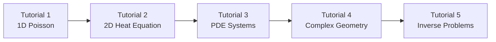

# DeepXDE Tutorial Series | DeepXDE教程系列

> **目标**: 从零基础到精通，系统学习使用DeepXDE求解偏微分方程

[](https://github.com/lululxvi/deepxde)
[](https://www.python.org/)
[]()

---

## 📚 教程概览

### 🎯 学习路径



### 📖 教程列表

| 序号 | 教程名称 | 文件 | 难度 | 学习时间 | 核心概念 |
|------|----------|------|------|----------|----------|
| 1️⃣ | **1D泊松方程** | [`poisson_1d.ipynb`](poisson_1d.ipynb) | ⭐⭐ | 30分钟 | PDE基础, 边界条件, PINN |
| 2️⃣ | **2D热传导方程** | [`heat_2d.ipynb`](heat_2d.ipynb) | ⭐⭐⭐ | 45分钟 | 时空PDE, 初始条件, 多维可视化 |
| 3️⃣ | **PDE方程组** | [`system_pde.ipynb`](system_pde.ipynb) | ⭐⭐⭐⭐ | 60分钟 | 耦合系统, 多变量PDE, 反应扩散 |
| 4️⃣ | **复杂几何域** | `complex_geometry.ipynb` | ⭐⭐⭐⭐ | 45分钟 | 不规则域, CSG几何 |
| 5️⃣ | **逆问题求解** | `inverse_problems.ipynb` | ⭐⭐⭐⭐⭐ | 90分钟 | 参数反演, 数据同化 |

---

## 🚀 快速开始

### 环境配置

```bash
# 1. 克隆项目
git clone https://github.com/your-repo/deepxde-learn.git
cd deepxde-learn/learn/tutorial

# 2. 安装依赖
pip install deepxde matplotlib numpy scipy

# 3. 启动Jupyter
jupyter notebook
```

### 🔧 系统要求

| 组件 | 最低版本 | 推荐版本 | 说明 |
|------|----------|----------|------|
| **Python** | 3.7+ | 3.9+ | 主要运行环境 |
| **DeepXDE** | 1.10+ | 1.12+ | 核心PDE求解库 |
| **TensorFlow** | 2.4+ | 2.8+ | 默认后端 |
| **NumPy** | 1.18+ | 1.21+ | 数值计算 |
| **Matplotlib** | 3.3+ | 3.5+ | 可视化工具 |

---

## 📋 学习计划建议

### 🌟 初学者路径 (2-3周)
```
Week 1: Tutorial 1 (1D Poisson) 
        → 理解PINN基础概念
        
Week 2: Tutorial 2 (2D Heat)
        → 掌握时空问题处理
        
Week 3: 复习 + 实践项目
        → 选择感兴趣的物理问题
```

### 🔥 进阶路径 (4-6周)
```
Week 1-2: Tutorial 1-2 (基础)
Week 3-4: Tutorial 3-4 (高级)  
Week 5-6: Tutorial 5 + 项目实战
```

### ⚡ 快速上手 (1周)
```
Day 1-2: Tutorial 1 (重点理解)
Day 3-4: Tutorial 2 (快速浏览)
Day 5-7: 选择应用场景实战
```

---

## 🧠 核心概念图谱

### 数学基础
- **偏微分方程 (PDE)**: 物理规律的数学表述
- **边界条件**: 定义域边界上的约束
- **初始条件**: 时变问题的起始状态
- **解析解**: 精确的数学解（用于验证）

### 物理直觉
- **扩散过程**: 热传导、浓度扩散
- **波动现象**: 振动、声波传播
- **守恒定律**: 能量、质量、动量守恒
- **多尺度问题**: 时间/空间多尺度耦合

### 技术实现
- **神经网络**: 函数近似器
- **自动微分**: 计算偏导数
- **损失函数**: PDE残差 + 边界/初始条件
- **优化算法**: Adam, L-BFGS等

---

## 🎯 每个教程的学习目标

### Tutorial 1: 1D Poisson Equation
```python
# 你将学会：
✅ PDE问题的基本设置和求解流程
✅ 边界条件的定义和应用
✅ 神经网络结构的选择策略
✅ 训练过程监控和结果验证
✅ 解的物理意义解释
```

### Tutorial 2: 2D Heat Equation
```python
# 你将掌握：
✅ 多维时空问题的处理方法
✅ 初始条件与边界条件的结合
✅ 时变PDE的可视化技巧
✅ 复杂度增加带来的挑战和对策
✅ 物理扩散过程的数值模拟
```

### Tutorial 3: PDE Systems
```python
# 你将探索：
✅ 多变量耦合PDE系统求解
✅ 反应扩散方程组的数值模拟
✅ 多输出神经网络的构建和训练
✅ 变量间耦合效应的分析
✅ 复杂系统的可视化技巧
```

### Tutorial 4: Complex Geometry (计划中)

---

## 🛠️ 工具和技巧

### 调试技巧
- **损失监控**: 观察PDE残差、边界条件、初始条件的损失组成
- **梯度检查**: 验证自动微分的正确性
- **采样可视化**: 检查采样点分布是否合理
- **解的物理性**: 验证结果是否符合物理直觉

### 性能优化
- **网络结构**: 调整深度/宽度平衡精度与效率
- **采样策略**: 在关键区域增加采样密度
- **学习率调度**: 使用自适应学习率
- **硬件加速**: 利用GPU加速训练过程

### 可视化技巧
- **1D问题**: 线图、误差分布图
- **2D问题**: 等高线图、3D曲面、动画
- **3D问题**: 切片可视化、体渲染
- **训练过程**: 损失曲线、梯度流

---

## 🤝 贡献指南

### 如何贡献
1. **提交bug报告**: 发现问题请在Issues中详细描述
2. **改进文档**: 优化教程内容和代码注释
3. **添加示例**: 贡献新的物理问题案例
4. **性能优化**: 提升训练效率和精度

### 代码规范
```python
# 文档字符串格式
def pde_function(x, y):
    """
    PDE定义函数
    
    Args:
        x: 输入坐标 (N, dim)
        y: 网络输出 (N, 1)
        
    Returns:
        PDE残差 (N, 1)
    """
    pass
```

---

## 📞 获取帮助

### 常见问题
- **Q: 训练不收敛怎么办？**
  - A: 检查PDE定义、增加采样点、调整网络结构、降低学习率

- **Q: 内存不足怎么处理？**
  - A: 减少采样点数量、使用批处理、降低网络复杂度

- **Q: 如何选择网络结构？**
  - A: 从简单开始，逐渐增加复杂度，平衡精度与效率

### 社区资源
- 📖 [DeepXDE官方文档](https://deepxde.readthedocs.io/)
- 💬 [GitHub Discussions](https://github.com/lululxvi/deepxde/discussions)
- 📝 [论文列表](https://github.com/lululxvi/deepxde/blob/master/REFERENCES.md)
- 🎥 [视频教程](https://www.youtube.com/playlist?list=PLV7LvtPPT4d5F)

---

## 📄 许可证

本教程系列遵循 [MIT License](../../LICENSE)，欢迎自由使用和分享。

---

## 🙏 致谢

感谢以下项目和团队：
- [DeepXDE](https://github.com/lululxvi/deepxde) - 核心PDE求解框架
- [TensorFlow](https://tensorflow.org/) - 深度学习后端
- [SciML](https://sciml.ai/) - 科学计算生态系统

---

<div align="center">

**Happy Learning! 开始你的PDE求解之旅吧！** 🚀

[](https://github.com/lululxvi/deepxde)
[]()

</div>